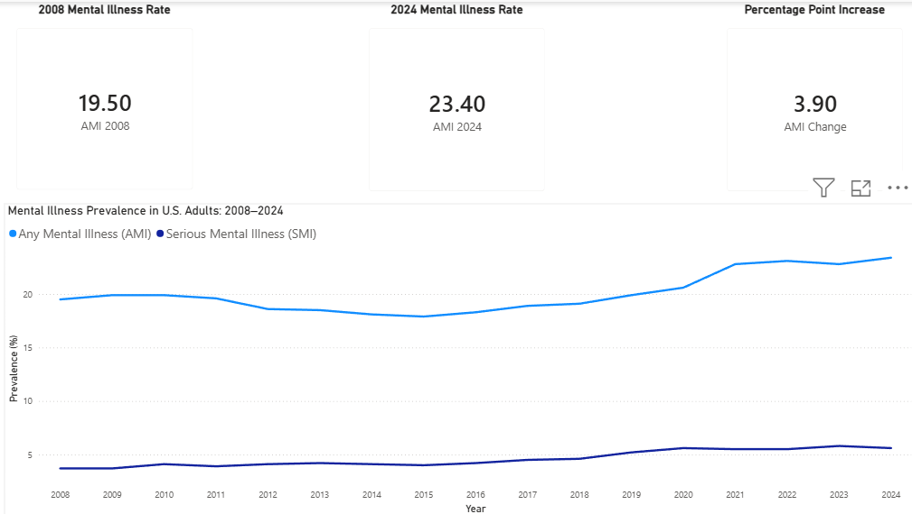
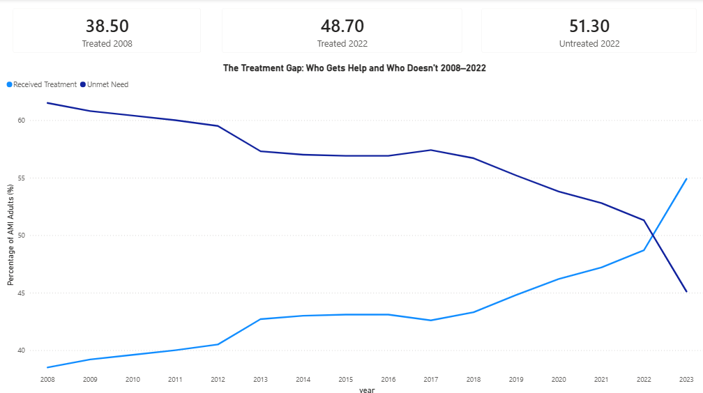
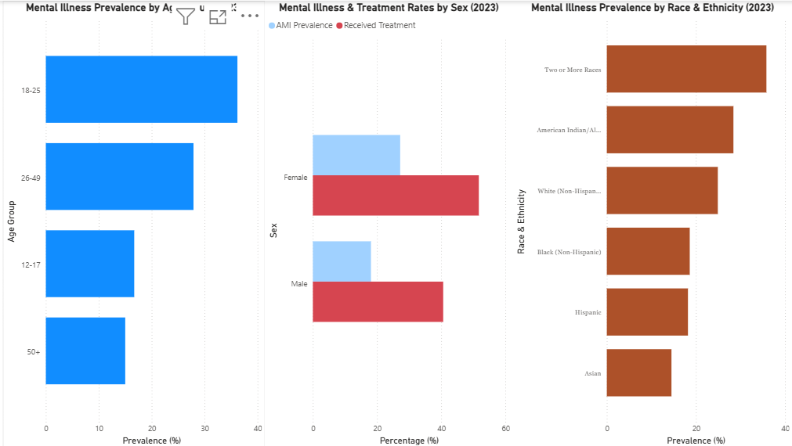
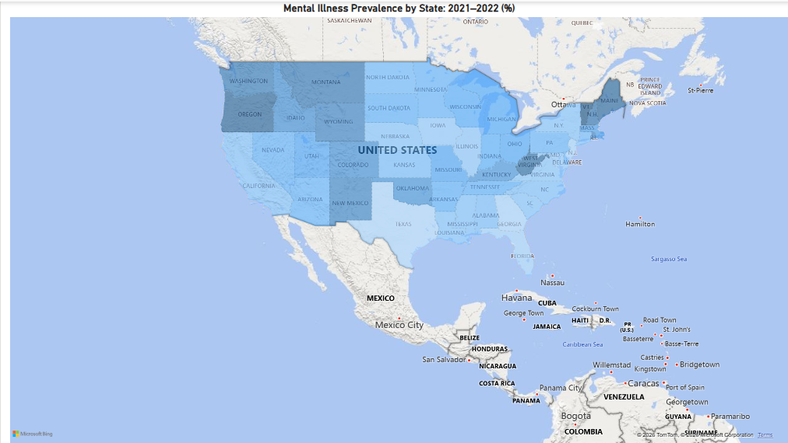
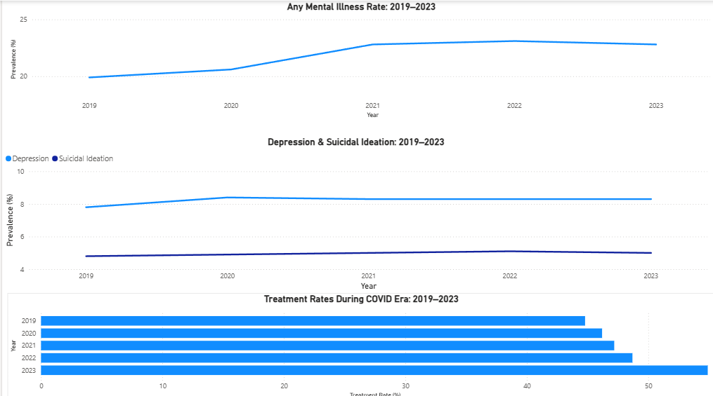

# 🧩 Mental Health in America: Trends & Treatment Gaps
### Public Health Analytics Series — Project 3 of 3 | Tools: Python, SQLite, Power BI

A data-driven investigation into the state of mental health in the United States from 2008 to 2024. Drawing from SAMHSA's National Survey on Drug Use and Health (NSDUH), this project tracks the rise of any mental illness (AMI) and serious mental illness (SMI) across 17 years, examines who is most affected, and exposes the persistent gap between those who need care and those who receive it — a gap widened dramatically by the COVID-19 pandemic.

---

## 📁 Project Structure

```
mental-health-trends/
│
├── csv/                              # Source data files
│   ├── mh_national_trend.csv
│   ├── mh_treatment_gap.csv
│   ├── mh_demographics_age.csv
│   ├── mh_demographics_sex.csv
│   ├── mh_demographics_race.csv
│   ├── mh_covid_impact.csv
│   └── mh_state_data.csv
│
├── screenshots/                      # Dashboard page screenshots
│   ├── mh_overview.png
│   ├── mh_treatment_gap.png
│   ├── mh_demographics.png
│   ├── mh_state_map.png
│   └── mh_covid_impact.png
│
├── mental_health_etl.py              # Python ETL script
├── mental_health.db                  # SQLite database
└── Mental Health.pbix                # Power BI dashboard
```

---

## 📊 Data Sources

All data sourced from official U.S. government publications — no paywalls, no applications required.

| Source | Coverage | What It Provides |
|--------|----------|-----------------|
| SAMHSA NSDUH Annual Reports | 2008–2024 | AMI & SMI prevalence, treatment rates, demographics |
| NIMH Mental Health Statistics | 2022–2023 | Sex and race/ethnicity breakdowns |
| SAMHSA NSDUH State Estimates | 2021–2022 | State-level AMI prevalence |

---

## 🔧 Tools & Workflow

**Python** → data compilation from verified SAMHSA published figures, CSV export, SQLite export

**SQLite** → structured storage and SQL analysis queries

**Power BI** → 5-page interactive dashboard with map visualization

---

## 🗄️ Database Schema

Seven tables loaded into `mental_health.db`:

| Table | Rows | Description |
|-------|------|-------------|
| `national_trend` | 17 | AMI & SMI prevalence 2008–2024 |
| `treatment_gap` | 16 | Treatment rates vs unmet need 2008–2023 |
| `demographics_age` | 5 | AMI by age group 2023 |
| `demographics_sex` | 2 | AMI by sex 2023 |
| `demographics_race` | 6 | AMI by race/ethnicity 2023 |
| `covid_impact` | 5 | Mental health indicators 2019–2023 |
| `state_data` | 51 | State-level AMI prevalence 2021–2022 |

---

## 🔍 SQL Analysis

### National Trend 2008–2024
```sql
SELECT year, ami_pct, smi_pct, ami_millions
FROM national_trend
ORDER BY year;
```

### Treatment Gap Over Time
```sql
SELECT year, ami_pct, received_treatment_pct, unmet_need_pct
FROM treatment_gap
ORDER BY year;
```

### Demographics by Age
```sql
SELECT age_group, ami_pct, smi_pct, received_treatment_pct
FROM demographics_age
ORDER BY ami_pct DESC;
```

### Racial & Ethnic Disparities
```sql
SELECT race_ethnicity, ami_pct, smi_pct
FROM demographics_race
ORDER BY ami_pct DESC;
```

### COVID Impact
```sql
SELECT year, ami_pct, depression_pct, suicidal_ideation_pct, received_treatment_pct
FROM covid_impact
ORDER BY year;
```

---

## 📈 Dashboard — Page by Page

### Page 1 — Overview


Mental illness prevalence among U.S. adults climbed from **19.5% in 2008 to 23.4% in 2024** — representing over 61.5 million Americans. The trend line reveals a notable dip to 17.9% in 2015 before a steady climb accelerated dramatically by the COVID-19 pandemic beginning in 2020.

🔎 **Key Finding:** The 3.9 percentage point increase over 17 years translates to roughly 16 million additional Americans living with mental illness. Serious Mental Illness (SMI) grew even faster in relative terms — from 3.7% in 2008 to 5.6% in 2024, a 51% increase.

---

### Page 2 — The Treatment Gap


In 2008, only 38.5% of adults with mental illness received treatment — leaving 61.5% with unmet need. By 2023 that gap had narrowed significantly, with 54.9% receiving treatment and 45.1% still going without care.

🔎 **Key Finding:** The two trend lines — received treatment rising, unmet need falling — are converging toward a crossover point. While progress is real, **nearly half of all mentally ill Americans still receive no treatment**, representing tens of millions of people going without care every year.

---

### Page 3 — Demographics


Mental illness does not affect all Americans equally. Age, sex, and race/ethnicity all produce meaningful disparities in both prevalence and treatment access.

🔎 **Key Findings:**
- **Young adults aged 18–25** have the highest AMI rate at **36.2%** — more than 1 in 3 — yet are the least likely to receive treatment (51%)
- **Women are diagnosed at significantly higher rates** than men (27.2% vs 18.1%), yet men receive treatment at dramatically lower rates (40.6% vs 51.7%)
- **Adults identifying as Two or More Races** have the highest AMI prevalence at **35.8%**, followed by American Indian/Alaska Native adults at 28.4% — nearly 2.5x the rate of Asian adults (14.5%)

---

### Page 4 — State Map


Mental illness prevalence varies significantly across states, with the Pacific Northwest, New England, and parts of the Mountain West showing the highest rates.

🔎 **Key Finding:** Vermont leads all states at **27.1%** prevalence, followed by Oregon (26.4%), New Hampshire (25.5%), and Montana (25.3%). The lowest rates appear in Texas (18.2%), New Jersey (18.5%), and Georgia (18.4%). The geographic pattern reflects differences in reporting culture, healthcare access, and demographic composition rather than a simple regional divide.

---

### Page 5 — COVID Impact


The COVID-19 pandemic produced the sharpest single-year increase in mental illness prevalence in the 17-year dataset. AMI jumped from 19.9% in 2019 to 22.8% in 2021 — a 2.9 percentage point spike in just two years.

🔎 **Key Finding:** Despite the surge in mental illness during COVID, treatment rates actually **improved every single year from 2019 to 2023** — rising from 44.8% to 54.9%. The expansion of telehealth services during the pandemic is widely credited with increasing treatment access, particularly for populations who previously faced geographic or scheduling barriers to in-person care.

---

## 💡 Key Takeaways

- Mental illness prevalence increased **20%** from 2008 to 2024 — from 19.5% to 23.4% of U.S. adults
- **Nearly half of mentally ill Americans** still receive no treatment despite significant progress closing the gap
- **Young adults aged 18–25** are the most affected demographic at 36.2% — and among the least likely to seek help
- **Men are dramatically undertreated** — diagnosed at lower rates and receiving care at only 40.6% vs 51.7% for women
- **COVID accelerated both the crisis and the response** — prevalence spiked while telehealth expanded treatment access simultaneously
- Racial disparities are significant — a **21 percentage point gap** separates the highest (Two or More Races, 35.8%) and lowest (Asian, 14.5%) groups

---

## 🗂️ Portfolio Navigation — Public Health Analytics Series

| # | Project | Tools |
|---|---------|-------|
| 1 | [ADHD in America: A 25-Year Analysis](https://github.com/brycegardner90/adhd-in-america) | Python, SQLite, Power BI |
| 2 | [The Opioid Crisis: A 25-Year Analysis](https://github.com/brycegardner90/opioid-crisis-analysis) | Python, SQLite, Power BI |
| **3** | **Mental Health in America: Trends & Treatment Gaps** | **Python, SQLite, Power BI** |
